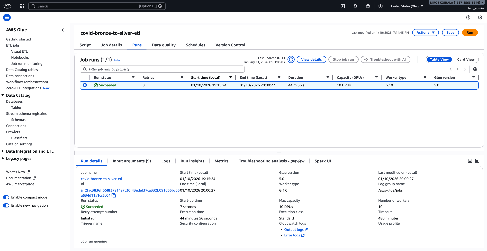
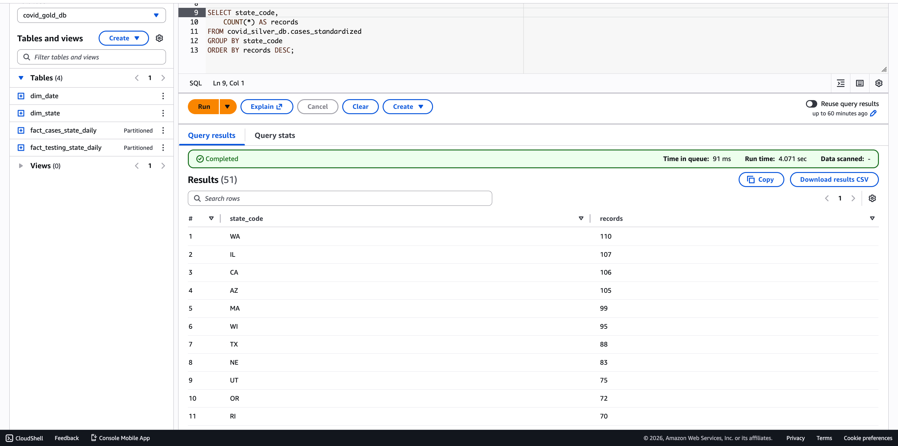
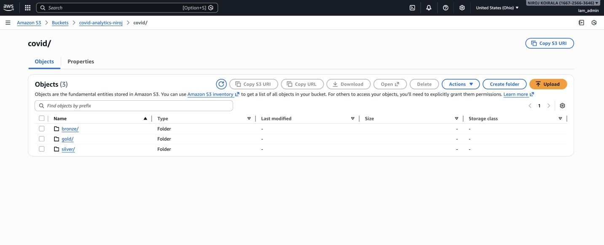

# 🚀 AWS Bronze–Silver–Gold COVID Data Pipeline

An end-to-end **AWS Data Engineering pipeline** implementing the **Bronze → Silver → Gold** lakehouse architecture using **Amazon S3, AWS Glue (PySpark), Amazon Athena, and Amazon Redshift** to ingest, transform, validate, and analyze COVID-19 data at scale.

This project demonstrates **real-world, production-style data engineering best practices** including layered storage, scalable Spark ETL, data validation, and analytics-ready modeling.

------
## 📌 Project Overview

The primary goal of this project is to showcase **how a well-structured data pipeline is designed, organized, and validated in a cloud environment**, rather than focusing only on individual tools.

It emphasizes **pipeline structure, data lifecycle management, and separation of responsibilities across data layers**, reflecting how modern data platforms are built and maintained in production settings.

---

## 🧠 Tech Stack

| Category | Tools & Technologies |
|--------|----------------------|
| **Cloud Provider** | AWS |
| **Storage (Data Lake)** | Amazon S3 (Bronze, Silver, Gold layers) |
| **ETL / Processing** | AWS Glue, Apache Spark (PySpark) |
| **Data Validation** | Amazon Athena |
| **Analytics / Warehousing** | Amazon Redshift |
| **Programming Language** | Python, PySpark |
| **Architecture Pattern** | Bronze–Silver–Gold Lakehouse Architecture |
| **Data Format** | CSV |
| **Use Case** | Batch Data Processing & Analytics |

-------------------


## 🏗️ Architecture Diagram 


<table width="100%">
  <tr>
    <td align="center">
      
    </td>
  </tr>
  <tr>
    <td align="center">
      <b style="font-size:18px;">AWS Bronze–Silver–Gold ETL Architecture</b>
    </td>
  </tr>
  <tr>
    <td align="center">
      This diagram represents the end-to-end AWS data pipeline implementing the
      <b>Bronze → Silver → Gold</b> lakehouse architecture. Raw COVID-19 data is ingested
      into Amazon S3 (Bronze), transformed and standardized using AWS Glue PySpark jobs
      (Silver), aggregated into analytics-ready datasets (Gold), validated with Amazon Athena,
      and analyzed using Amazon Redshift.
    </td>
  </tr>
</table>

---

## 📸 Pipeline Execution & Validation

---
This section showcases the end-to-end execution of the AWS Bronze–Silver–Gold pipeline, covering ETL processing, validation, storage layout, and analytics.

<table width="100%"> <tr> <td align="center" width="50%">  </td> <td align="center" width="50%">  </td> </tr> <tr> <td align="left"> <b style="font-size:18px;">AWS Glue ETL Job Success</b> </td> <td align="right"> <b style="font-size:18px;">Amazon Athena Data Validation</b> </td> </tr> <tr> <td align="left"> PySpark-based AWS Glue jobs successfully executed, transforming raw COVID data from the Bronze layer into cleaned and standardized Silver datasets. </td> <td align="right"> Athena SQL queries validate schema integrity, record counts, and data correctness before downstream analytics. </td> </tr> </table>
<br/> <table width="100%"> <tr> <td align="center" width="50%">  </td> <td align="center" width="50%">  </td> </tr> <tr> <td align="left"> <b style="font-size:18px;">S3 Bronze–Silver–Gold Lakehouse Layout</b> </td> <td align="right"> <b style="font-size:18px;">Amazon Redshift Analytics Results</b> </td> </tr> <tr> <td align="left"> Clearly defined S3 folder structure separating raw, cleaned, and curated datasets following lakehouse best practices. </td> <td align="right"> Analytical SQL queries executed in Amazon Redshift on Gold-layer data to generate insights and reporting. </td> </tr> </table>

-------------

## 🎥 Pipeline Demo Video

<p align="center">
  <a href="demo/pipeline%20video.mp4">
    
    <br/>
    <b style="font-size:18px;">▶️ Watch Full Pipeline Demo</b>
  </a>
</p>


-----------

## 🧾 Raw Data Sources (Bronze Layer)

Raw COVID-19 data is sourced from the **AWS Open Data COVID-19 Lake**, including case counts, testing metrics, hospital capacity, and reference datasets.  The data is curated by trusted providers such as **Johns Hopkins**, **The New York Times**, **Definitive Healthcare**, and the **Allen Institute for AI**.

🔗 https://registry.opendata.aws/aws-covid19-lake/

---


### 📂 Raw Datasets (Bronze Layer)

| Dataset | Description | S3 Link |
|------|-----------|--------|
| **Johns Hopkins (JHU)** | Global & U.S. COVID-19 cases and deaths | https://covid19-lake.s3.us-east-2.amazonaws.com/enigma-jhu/ |
| **NY Times – U.S. States** | State-level COVID cases & deaths | https://covid19-lake.s3.us-east-2.amazonaws.com/enigma-nytimes-data-in-usa/ |
| **COVID Testing Data** | Daily testing metrics by state | https://covid19-lake.s3.us-east-2.amazonaws.com/rearc-covid-19-testing-data/ |
| **Hospital Beds Data** | U.S. hospital bed availability | https://covid19-lake.s3.us-east-2.amazonaws.com/rearc-usa-hospital-beds/ |
| **Static Reference Data** | State codes, mappings, metadata | https://covid19-lake.s3.us-east-2.amazonaws.com/static-datasets/ |

---
---

### 📂 Bronze Layer Datasets Used

| Dataset | Description |
|------|------------|
| `nytimes/us_states.csv` | Daily U.S. state-level COVID cases & deaths |
| `covid_tracking/states_daily.csv` | Daily testing metrics (positive, negative, total, positivity) |
| `static/states_abv.csv` | State name ↔ abbreviation mapping |

---

### 📊 Data Modeling Scope

**Dimensions**
- `dim_date` — calendar
- `dim_state` — U.S. states (code, name)

**Facts (daily, state-level)**
- `fact_cases_state_daily` — cases & deaths
- `fact_testing_state_daily` — tests & positivity

 These tables form the analytical foundation for the Silver and Gold layers following lakehouse best practices.

 -------------
 ## 📂 Project Structure


```
aws-bronze-silver-gold-covid-pipeline/
│
├── architecture/
│ └── etl_pipeline_architecture.png # End-to-end ETL architecture diagram
│
├── demo/
│ └── pipeline video.mp4 # Full pipeline walkthrough demo
│
├── screensots/
│ ├── etl.png # Bronze–Silver–Gold architecture (visual)
│ ├── glue-job-sucess.png # Glue PySpark job execution
│ ├── athena-validation.png # Data validation using Athena
│ ├── bron-sil-gol.jpg # S3 Bronze/Silver/Gold layout
│ └── redshift-query-results .png # Analytics queries in Redshift
│
├── scripts/
│ ├── bronze_to_silver_etl.py # PySpark ETL: Bronze → Silver
│ └── silver_to_gold_glue.py # PySpark ETL: Silver → Gold
│
└── README.md # Project documentation
```

--------------
## ▶️ How to Run This Project

1. **Upload raw datasets** (CSV) from AWS Open Data into the **S3 Bronze layer**.
2. **Run AWS Glue PySpark job** (`bronze_to_silver_etl.py`) to clean and standardize data into the **Silver layer**.
3. **Run second Glue job** (`silver_to_gold_glue.py`) to create aggregated, analytics-ready **Gold datasets**.
4. **Validate data** using SQL queries in **Amazon Athena**.
5. **Query analytics** tables in **Amazon Redshift** for reporting and insights.

> This project uses fully managed AWS services (S3, Glue, Athena, Redshift); no local setup is required.
----------
**✅ Conclusion**
-------

This project demonstrates an end-to-end **AWS data engineering pipeline **built using modern lakehouse best practices. It showcases real-world skills in **cloud data ingestion,** **scalable ETL with PySpark**, **data validation, and analytics**,using fully managed **AWS services**.The architecture and implementation are designed to be production-oriented,**cost-efficient**, and easily extensible, making it suitable for large-scale batch** analytics use cases.

----------
<p align="center">
  <b>Happy Learning — Keep Building, Keep Exploring 🚀</b>
</p>

